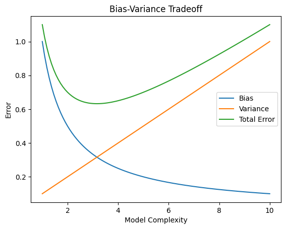

# Bias-Variance Tradeoff

## Overview

In Machine Learning, a model should not be too simple or too complex.

- A simple model may fail to capture patterns (underfitting)  
- A complex model may capture noise (overfitting)  

The balance between these two is called the **Bias-Variance Tradeoff**.

---

## What is Bias?

Bias refers to the error caused by overly simple assumptions in the model.

A high-bias model:
- is too simple  
- ignores important patterns  
- leads to underfitting  

### Characteristics

- Low training accuracy  
- Low testing accuracy  
- Poor learning of data patterns  

### Example

Using a straight line (linear model) to fit data that actually follows a curve.

---

## What is Variance?

Variance refers to how much the model’s predictions change with different training data.

A high-variance model:
- is very sensitive to data  
- captures noise  
- leads to overfitting  

### Characteristics

- Very high training accuracy  
- Low testing accuracy  
- Poor generalization  

### Example

A very complex model that memorizes training data instead of learning patterns.

---

## Relationship with Model Complexity

- Low complexity → High Bias, Low Variance  
- High complexity → Low Bias, High Variance  

As model complexity increases:
- Bias decreases  
- Variance increases  

---

## Bias vs Variance Comparison

| Aspect | High Bias | High Variance |
|-------|-----------|--------------|
| Model Complexity | Low | High |
| Training Accuracy | Low | High |
| Testing Accuracy | Low | Low |
| Problem | Underfitting | Overfitting |

---

## Visual Representation



---

## Graph Explanation

- Left side → Model is too simple → High Bias (Underfitting)  
- Right side → Model is too complex → High Variance (Overfitting)  
- Middle → Optimal balance → Best performance  

---

## Goal of Machine Learning

An ideal model should have:
- Low Bias  
- Low Variance  

This ensures good performance on unseen data.

---

## How to Reduce Bias?

- Use a more complex model  
- Add more features  
- Reduce strong assumptions  

---

## How to Reduce Variance?

- Use more training data  
- Simplify the model  
- Apply regularization  

---

## Key Takeaway

A good model is one that:
- learns patterns from data  
- avoids memorizing noise  
- performs well on new data  

```md
The goal is to find the right balance between bias and variance.
